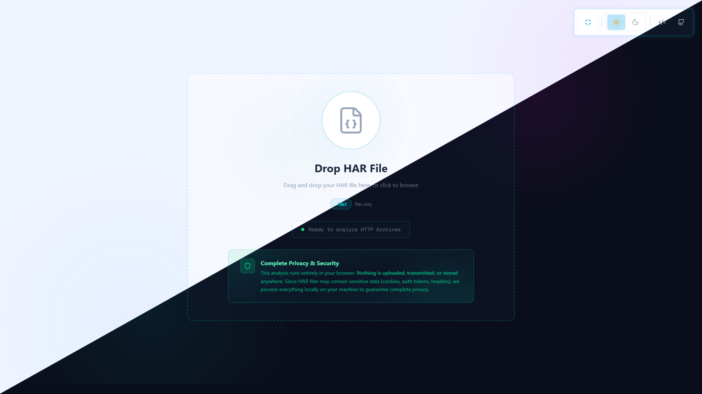
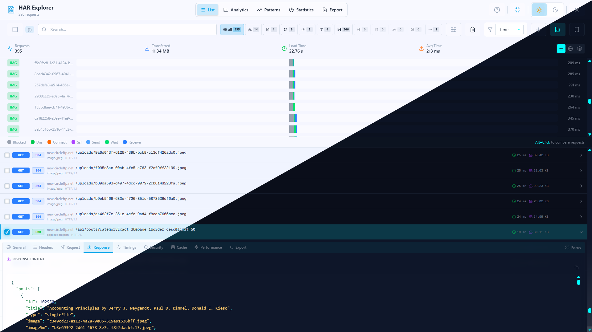
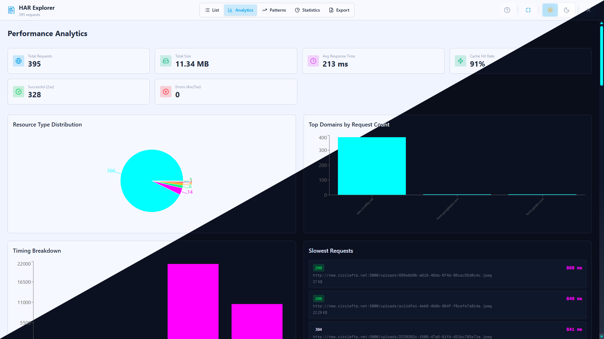
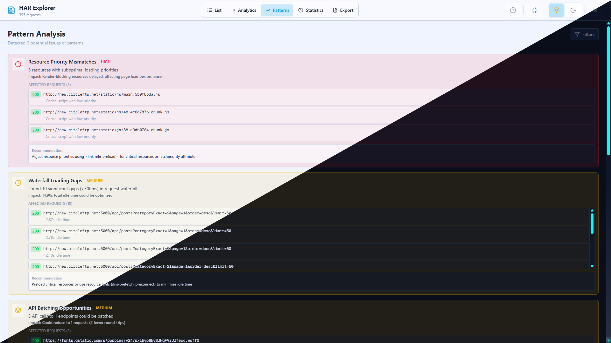
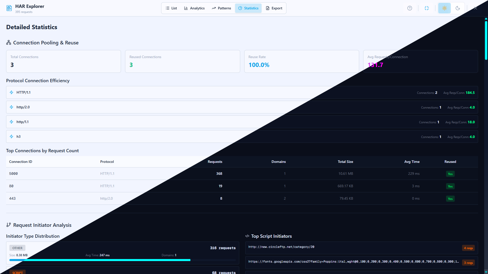
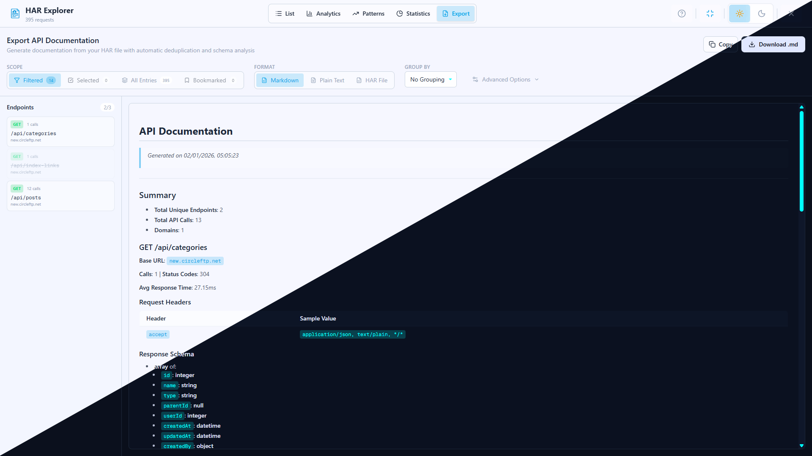

# HAR Explorer

<div align="center">
  
  
  ### HTTP Archive File Analyzer & Editor
  
  A powerful, privacy-focused web application for analyzing and debugging HTTP Archive (HAR) files directly in your browser.
  
  **🌐 [Try it now at har-explorer.vercel.app](https://har-explorer.vercel.app)**
  
  [](LICENSE)
  [](https://nextjs.org/)
</div>

---

## Features

**HAR File Viewing**  
Browse HTTP Archive files with detailed request and response information

**Network Timeline**  
Interactive waterfall chart showing request timings and dependencies

**Analytics Dashboard**  
Comprehensive analytics including bandwidth timeline, protocol analysis, and third-party impact

**Pattern Detection**  
Automatic detection of performance issues like duplicate requests, large cookies, and mixed content

**Statistics View**  
Detailed statistics including domain analysis, connection reuse, and transfer efficiency

**Entry Details**  
Deep inspection of individual requests with headers, timings, security, and cache information

**Export Functionality**  
Export filtered data to Markdown, plain text, or HAR format

**Bookmarking**  
Bookmark important requests for quick access and export

**Advanced Filtering**  
Filter by resource type, status code, size, duration, domain, headers, and HTTP version

**Keyboard Shortcuts**  
Efficient navigation with comprehensive keyboard shortcuts

**Dark Mode**  
Full dark and light theme support with system preference detection

**Privacy First**  
All processing happens client-side. No data is uploaded to any server

## Screenshots

<div align="center">
  
  <p><em>Landing page with file upload</em></p>
</div>

<div align="center">
  
  <p><em>Request list with timeline and filtering</em></p>
</div>

<div align="center">
  
  <p><em>Comprehensive analytics dashboard</em></p>
</div>

<div align="center">
  
  <p><em>Automatic pattern detection and analysis</em></p>
</div>

<div align="center">
  
  <p><em>Detailed statistics and insights</em></p>
</div>

<div align="center">
  
  <p><em>Export functionality with multiple format options</em></p>
</div>

## Tech Stack

**Framework**: [Next.js 16.1](https://nextjs.org/) with App Router  
**UI**: React 19, TypeScript  
**Styling**: Tailwind CSS v4  
**State Management**: Zustand  
**Charts**: Recharts  
**Icons**: Lucide React  
**Virtualization**: TanStack Virtual

## Getting Started

### Prerequisites

Node.js 20+  
pnpm (recommended)

### Installation

```bash
# Clone the repository
git clone https://github.com/ShariarShuvo1/har-explorer.git

# Navigate to the project directory
cd har-explorer

# Install dependencies
pnpm install

# Start the development server
pnpm dev
```

Open [http://localhost:3000](http://localhost:3000) in your browser.

### Build for Production

```bash
pnpm build
pnpm start
```

## How to Use

**Generate a HAR File**

Chrome: Open DevTools (F12) → Network tab → Right-click → "Save all as HAR with content"  
Firefox: Open DevTools → Network tab → Right-click → "Save All As HAR"

**Load Your HAR File**

Drag and drop your .har file onto the upload zone, or click to browse and select your file

**Analyze**

Browse the request list and timeline, switch between different views (Analytics, Patterns, Statistics), use filters and search to find specific requests, bookmark important entries, and export your findings

## Privacy & Security

HAR files often contain sensitive information like cookies, authentication tokens, and API keys. **HAR Explorer processes everything locally in your browser** - no data is ever transmitted to any server. Your HAR files remain completely private and secure on your device.

## Requirements

Modern browser with JavaScript enabled  
Minimum screen width: 1024px (optimized for desktop/laptop)

## Author

**Shariar Islam Shuvo**

GitHub: [@ShariarShuvo1](https://github.com/ShariarShuvo1)

## License

This project is open source and available under the MIT License.

---
