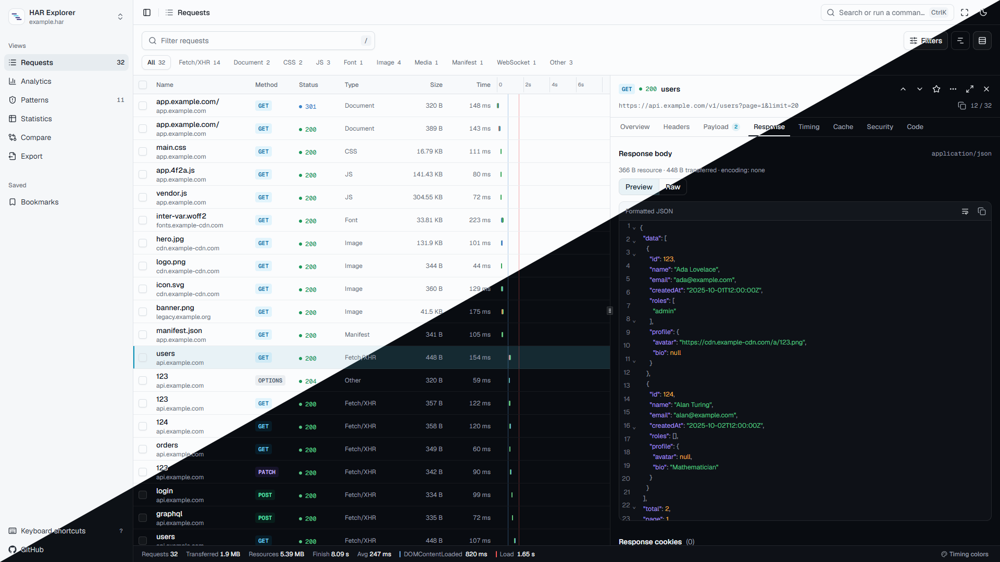
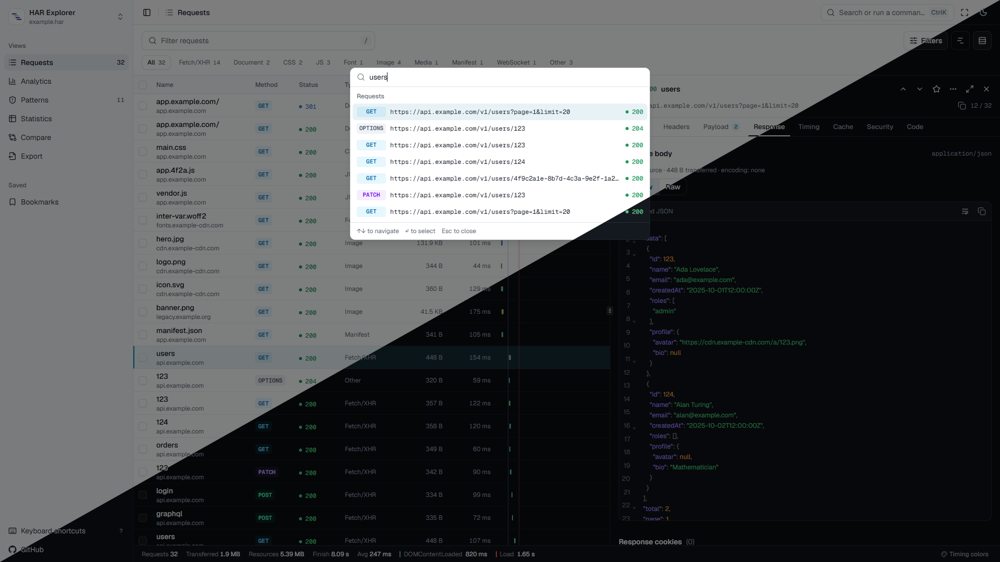
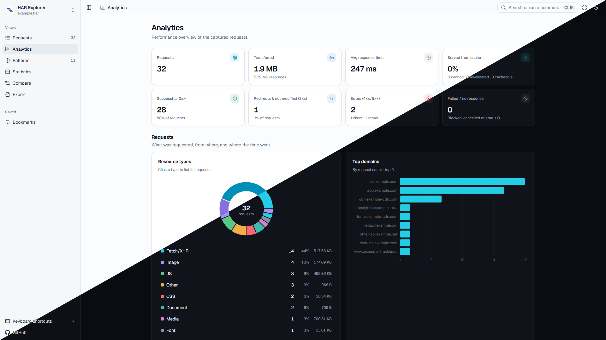
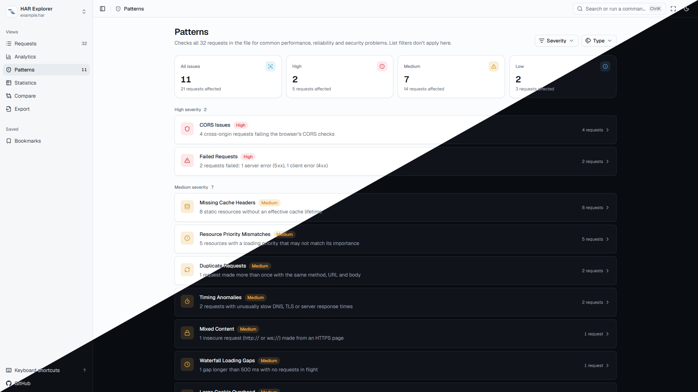
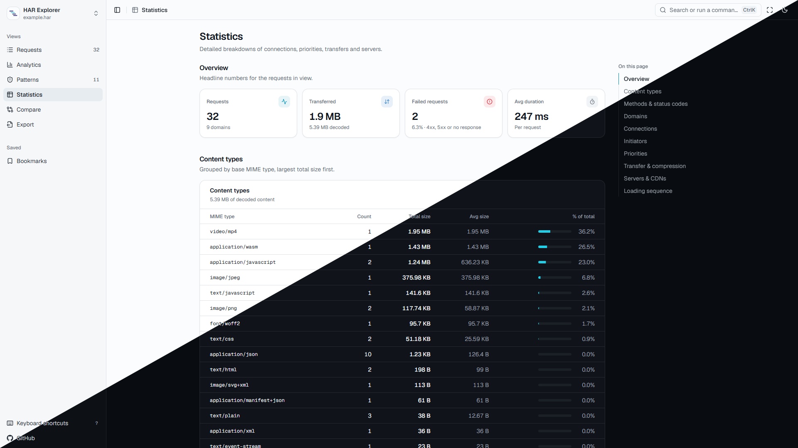
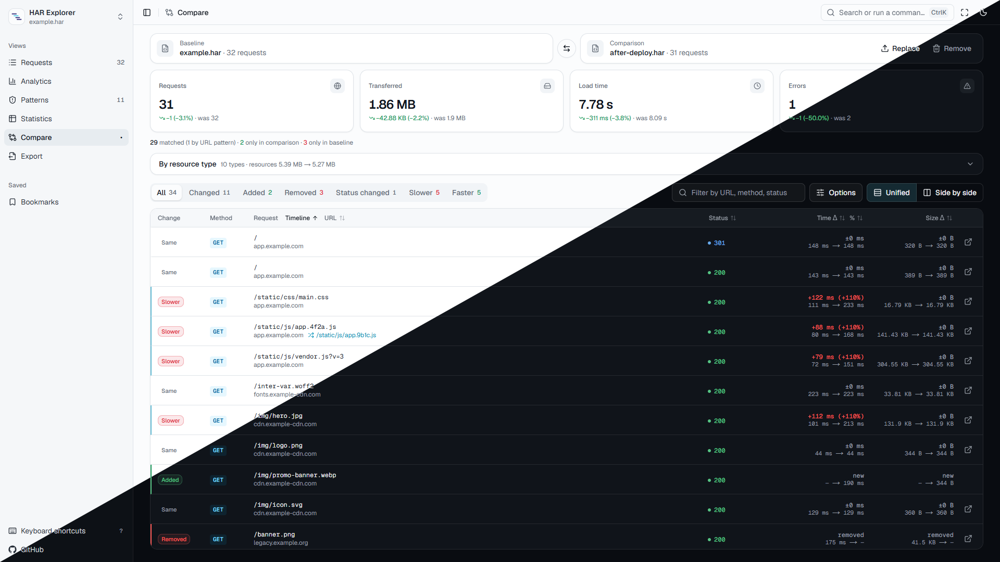
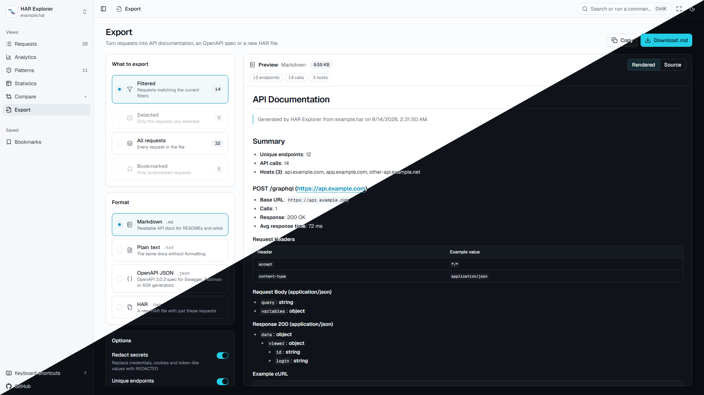
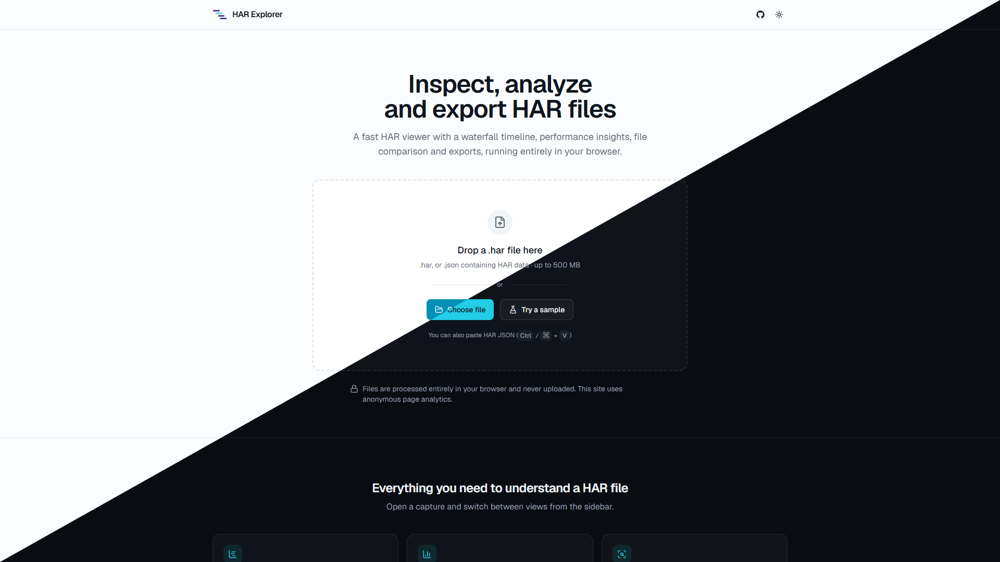

<div align="center">
  

  <h1>HAR Explorer</h1>

  <p><strong>Inspect, analyze, compare and export HAR files, entirely in your browser.</strong></p>

  <p>
    <a href="https://har-explorer.vercel.app"><strong>Open HAR Explorer →</strong></a>
  </p>

  <p>
    
    
    
    
    <a href="./LICENSE"></a>
  </p>
</div>



HAR Explorer is a fast, privacy-first viewer for HTTP Archive (`.har`) files. It gives you a DevTools-style request list and waterfall, and adds what DevTools doesn't: performance analytics, automatic issue detection, before/after comparison, request editing with undo, and exports to API docs, OpenAPI or a trimmed HAR. Your file never leaves your machine.

## Contents

- [Features](#features)
- [Getting a HAR file](#getting-a-har-file)
- [Using HAR Explorer](#using-har-explorer)
- [Keyboard shortcuts](#keyboard-shortcuts)
- [Privacy](#privacy)
- [Running locally](#running-locally)
- [Project structure](#project-structure)
- [Tech stack](#tech-stack)
- [Changelog](./CHANGELOG.md)
- [License](#license)

## Features

### Request list and waterfall

The main view works like the Network panel you already know, and stays smooth with tens of thousands of requests.

- **Virtualized list** with sortable, configurable columns (name, method, status, type, size, time, waterfall).
- **Waterfall** with DOMContentLoaded and Load markers. Hover a bar for a phase-by-phase timing breakdown.
- **Overview strip**: drag across it to zoom into a time range, then pan with the arrow keys.
- **Search and quick type filters** (Fetch/XHR, Document, CSS, JS, Font, Image, Media, Manifest, WebSocket, Other).
- **Advanced filters** for status code or class, method, HTTP version, size, duration, domain and path (substring or `/regex/`), and request or response headers.
- **Grouping** by domain or resource type, with collapsible groups.
- **Selection and bulk actions**: bookmark, export or delete many requests at once, or pick two and compare their timings side by side.
- **Status bar** with request count, transferred and resource sizes, finish time and page-load markers.
- **Right-click menu** on any row: copy the URL, response body or the request as cURL/fetch/PowerShell, bookmark, delete and more.
- **Phone-friendly**: below tablet width the list switches to cards and the details open in a sheet.

### Request details

Click a request to open it in a resizable side pane, or maximize it. Step through requests with <kbd>J</kbd> and <kbd>K</kbd>.

| Tab          | What you get                                                                                                      |
| ------------ | ----------------------------------------------------------------------------------------------------------------- |
| **Overview** | URL, status, protocol, remote address, priority, initiator, sizes, timing and cache source at a glance            |
| **Headers**  | Request and response headers, searchable and editable                                                             |
| **Payload**  | Query parameters, form data and request body, with a code editor                                                  |
| **Response** | Formatted body with syntax highlighting, plus previews for JSON, HTML, images, fonts, audio and video             |
| **Timing**   | Blocked, DNS, connect, TLS, send, wait and receive phases, with performance insights and network efficiency notes |
| **Cache**    | Cache-Control directives, validators and expiry, all cache headers and recommendations                            |
| **Security** | Security-header checks (HSTS, CSP and more), cookie flags and other findings                                      |
| **Code**     | The request as cURL, fetch or PowerShell, or as Markdown docs, plain-text docs, OpenAPI or a single-entry HAR     |

**Edit anything:** URL, method, status, headers, query parameters and bodies. Every change, including deletes and bookmark edits, can be undone with <kbd>Ctrl</kbd>/<kbd>⌘</kbd>+<kbd>Z</kbd>, and you can download the edited capture as a new HAR.

### Command palette



Press <kbd>Ctrl</kbd>/<kbd>⌘</kbd>+<kbd>K</kbd> to jump to any request by URL, switch views, change the theme, open or close files, and run most actions without touching the mouse.

### Analytics



A performance overview of the capture:

- **Headline cards**: success, redirect and error counts, cache hit rate and average response time.
- **Breakdowns**: resource types and top domains.
- **Timing and speed**: timing phases, the slowest requests, and a bandwidth timeline.
- **Protocols**: HTTP/1.1 vs HTTP/2 vs HTTP/3 performance.
- **Third parties and images**: third-party impact and image optimization opportunities.

Click a resource type to list its requests.

### Pattern detection



HAR Explorer scans the whole capture for common performance, reliability and security problems, ranks them by severity and links each to the affected requests:

- **Failures:** failed requests, CORS issues, redirects.
- **Caching and payload:** duplicate requests, missing cache headers, large cookie overhead.
- **Loading:** sequential loading, waterfall loading gaps, resource priority mismatches.
- **Other:** timing anomalies, mixed content, API batching opportunities.

### Statistics



In-depth tables for content types, methods and status codes, domains, connection reuse, initiators, resource priorities, transfer size and compression, server IPs and CDNs, and the resource loading sequence. An "On this page" outline keeps long reports easy to navigate.

### Compare two captures



Load a second HAR file, for example from before and after a deploy, to see:

- **Totals:** how request count, transfer size, load time and errors changed.
- **Per request:** which requests were added, removed, slower, faster or changed status. Requests are matched by URL, and URL patterns catch hashed file names like `app.4f2a.js` → `app.9b1c.js`.

Switch between a unified diff and a side-by-side view.

### Export



- **What to export:** all, filtered, selected or bookmarked requests.
- **Formats:**
  - **Markdown** API documentation, with endpoints, parameters, headers, body schemas and example cURL.
  - **Plain text** documentation.
  - **OpenAPI 3.0.3** specification, ready for Swagger UI, Postman or code generators.
  - **HAR** file containing just those requests.
- **Options:** preview the result rendered or as source, then copy or download it. Credentials, cookies and token-like values are redacted by default.

### Bookmarks

Star important requests with a label, color and note. Browse and search them in the Bookmarks panel, show only bookmarked rows, or export them.

### Designed to feel familiar

- **Layout:** sidebar navigation, popovers and dialogs instead of cramped inline panels.
- **Feedback:** toasts with undo.
- **Themes:** light, dark, or follow your system.
- **Screen sizes:** works from phones up to ultrawide monitors.



## Getting a HAR file

| Browser           | Steps                                                                                                                                                                 |
| ----------------- | --------------------------------------------------------------------------------------------------------------------------------------------------------------------- |
| **Chrome / Edge** | Open DevTools (<kbd>F12</kbd>) → **Network** → reload the page → click the **Export HAR** (download) icon, or right-click the list → **Save all as HAR with content** |
| **Firefox**       | Open DevTools (<kbd>F12</kbd>) → **Network** → reload → right-click the list → **Save All As HAR**                                                                    |
| **Safari**        | Enable **Show features for web developers** in Settings → Advanced → open Web Inspector → **Network** → reload → **Export**                                           |

> [!WARNING]
> HAR files can contain cookies, auth tokens and personal data. HAR Explorer processes them locally, but be careful where else you share them.

## Using HAR Explorer

1. **Open a file:** drop a `.har` (or HAR-shaped `.json`) file anywhere on the page, click **Choose file**, paste HAR JSON with <kbd>Ctrl</kbd>/<kbd>⌘</kbd>+<kbd>V</kbd>, or click **Try a sample**. Files up to 500 MB are supported.
2. **Explore:** click a request to see its details and switch views from the sidebar (<kbd>1</kbd>–<kbd>6</kbd>).
3. **Narrow things down:** search with <kbd>/</kbd>, filter with <kbd>F</kbd>, or group and sort from the view options menu.
4. **Take action:** right-click requests for quick actions, edit what you need (undo is always one keystroke away), bookmark what matters.
5. **Share your findings:** export docs, an OpenAPI spec or a trimmed HAR from the **Export** view, or download the edited capture from the file menu.

## Keyboard shortcuts

Press <kbd>?</kbd> in the app to see these at any time. On macOS, use <kbd>⌘</kbd> instead of <kbd>Ctrl</kbd>.

| Shortcut                                       | Action                                                           |
| ---------------------------------------------- | ---------------------------------------------------------------- |
| <kbd>Ctrl</kbd>+<kbd>K</kbd>                   | Search requests or run a command                                 |
| <kbd>1</kbd> – <kbd>6</kbd>                    | Go to Requests, Analytics, Patterns, Statistics, Compare, Export |
| <kbd>Ctrl</kbd>+<kbd>B</kbd>                   | Toggle sidebar                                                   |
| <kbd>Ctrl</kbd>+<kbd>Z</kbd>                   | Undo last change                                                 |
| <kbd>/</kbd>                                   | Focus search                                                     |
| <kbd>F</kbd>                                   | Open filters                                                     |
| <kbd>R</kbd>                                   | Clear all filters                                                |
| <kbd>T</kbd>                                   | Toggle waterfall overview                                        |
| <kbd>J</kbd> / <kbd>K</kbd>                    | Next / previous request                                          |
| <kbd>Esc</kbd>                                 | Close details, then clear selection                              |
| <kbd>Ctrl</kbd>+<kbd>A</kbd>                   | Select all visible requests                                      |
| <kbd>Delete</kbd>                              | Delete selected requests                                         |
| <kbd>B</kbd>                                   | Bookmark the open request                                        |
| <kbd>Shift</kbd>+<kbd>B</kbd>                  | Show only bookmarked requests                                    |
| <kbd>Ctrl</kbd>+Click / <kbd>Shift</kbd>+Click | Add to selection / select a range                                |
| <kbd>?</kbd>                                   | Show all shortcuts                                               |

## Privacy

HAR files often contain sensitive information. **HAR Explorer parses and analyzes everything locally in your browser. Your HAR data is never uploaded, stored or sent anywhere.**

- **Exports:** generated documentation and specs redact credentials, cookies and token-like values by default.
- **Code snippets:** per-request snippets (cURL, fetch, PowerShell) keep the captured values so you can replay requests.
- **Analytics:** the hosted site only collects anonymous page analytics. Nothing from your files is included.

## Running locally

**Prerequisites:** Node.js 20.9 or newer, and [pnpm](https://pnpm.io).

```bash
git clone https://github.com/ShariarShuvo1/har-explorer.git
cd har-explorer
pnpm install
pnpm dev
```

Then open [http://localhost:3000](http://localhost:3000).

| Script              | Description                              |
| ------------------- | ---------------------------------------- |
| `pnpm dev`          | Start the development server (Turbopack) |
| `pnpm build`        | Create a production build                |
| `pnpm start`        | Serve the production build               |
| `pnpm lint`         | Run ESLint                               |
| `pnpm typecheck`    | Type-check with TypeScript               |
| `pnpm format`       | Format the codebase with Prettier        |
| `pnpm format:check` | Check formatting without changing files  |

### Environment variables

| Variable              | Required | Description                                                                                                       |
| --------------------- | -------- | ----------------------------------------------------------------------------------------------------------------- |
| `PUBLIC_DEPLOYED_URL` | No       | Canonical site URL used for metadata, `robots.txt` and the sitemap. Defaults to `https://har-explorer.vercel.app` |

## Project structure

```text
app/                          App Router entry: layout, page, icons, robots, sitemap
components/
  app-shell/                  Sidebar, top bar, command palette, shortcuts, providers
  landing/                    Landing page and file loading overlay
  views/
    requests/                 Request list, waterfall, filters, details pane, bookmarks
    analytics/                Analytics dashboard
    patterns/                 Pattern detection view
    statistics/               Statistics view
    compare/                  HAR comparison
    export/                   Export view
  common/                     Shared components (code editor, dialogs, badges, fields, logo)
  ui/                         shadcn/ui primitives
lib/
  stores/                     Zustand store with undo history
  analytics/ statistics/      Analysis for the Analytics and Statistics views
  patterns/                   Pattern detectors
  api-docs/                   Markdown, OpenAPI and HAR export, secret redaction
  entry/                      Per-request cache and security analysis
  hooks/                      File loading, filtering and layout hooks
  har-parser.ts               HAR parsing and normalization
  har-compare.ts              Capture comparison
  codegen.ts                  cURL, fetch and PowerShell generation
public/samples/               Synthetic sample HAR file
screenshots/                  README screenshots
```

## Tech stack

| Area         | Tools                                                                                                                                              |
| ------------ | -------------------------------------------------------------------------------------------------------------------------------------------------- |
| Framework    | [Next.js 16](https://nextjs.org) (App Router, Turbopack), [React 19](https://react.dev), [TypeScript 6](https://www.typescriptlang.org)            |
| UI           | [shadcn/ui](https://ui.shadcn.com) on [Radix UI](https://www.radix-ui.com), [Lucide](https://lucide.dev) icons, [Motion](https://motion.dev)       |
| Styling      | [Tailwind CSS 4](https://tailwindcss.com), [next-themes](https://github.com/pacocoursey/next-themes)                                               |
| State        | [Zustand 5](https://zustand.docs.pmnd.rs)                                                                                                          |
| Data display | [TanStack Virtual](https://tanstack.com/virtual), [Recharts 3](https://recharts.org), [CodeMirror 6](https://codemirror.net), react-markdown       |
| Overlays     | [cmdk](https://cmdk.paco.me), [Sonner](https://sonner.emilkowal.ski), [Vaul](https://vaul.emilkowal.ski), react-resizable-panels, react-day-picker |

## Author

Built by **Shariar Islam Shuvo** ([@ShariarShuvo1](https://github.com/ShariarShuvo1)).

Found a bug or have an idea? [Open an issue](https://github.com/ShariarShuvo1/har-explorer/issues).

## Changelog

See [CHANGELOG.md](./CHANGELOG.md) for release notes.

## License

Released under the [MIT License](./LICENSE).
